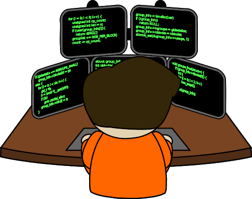

```{r setup, include=FALSE}
knitr::opts_chunk$set(echo = FALSE)
options("scipen" = 10)


```


# Softwares estadísticos


## SAS, SPAD, SPSS... y R


<br>

<p class="smallpcenter">**Desde principios de la década de 2000, un nuevo software** está ganando importancia y **se está estableciendo gradualmente como un punto de referencia**, al igual que los tres principales software de análisis de datos que dominan el mercado.</p> 


<p class="R"></p>


<p class="moyp">**Se puede imaginar que los usuarios de software estadístico convergerán gradualmente hacia el software (lenguaje) R**.</p>


<aside class="notes">
El mundo de la cienca y las empresas especializadas en minería de datos utilizan diferentes programas estadísticos como SAS, SPAD, SPSS o Stata. Este software, no necesariamente fácil de manejar, permiten un procesamiento más complejo que el que se podría hacer con un software convencional como la hoja de cálculo Excel.
</aside>


## Software Propietarios son... 

### Pagando


</p>
<p class="xsmallp" align="center">Licencia SPSS *Base edition*</p>


<aside class="notes">
La mayoría del software estadístico se vende por varios miles de pesos.
Y en general, con una suscripción de varios cientos de pesos mexicanos por mes/año y por computadora
</aside>


## No son multiplataforma


<br>
<br>


<aside class="notes">
Los principales programas informáticos estadísticos patentados no están disponibles en todos los sistemas operativos
</aside>


```{r }


Software <- c("SAS","SPAD","SPSS","Stata")
Windows <- c("sí","sí","sí","sí")
macOS <- c("terminado","no","sí","sí")
Linux <- c("sí","no","no","sí")
BSD <- c("no","no","no","no")
Otros_Unix <- c("sí","no","no","no")

tab <- data.frame(Software, Windows, macOS, Linux, BSD, Otros_Unix)

colnames(tab) <- c("Software/Sistemas"," Windows", "MacOS", "Linux", "BSD", "Otros Unix")


knitr::kable(tab)

          
```


<p class="xsmallp" align="center">*https://en.wikipedia.org/wiki/Comparison_of_statistical_packages*</p>


## Son especializados


<aside class="notes">
Estos programas de software se presentan como 'generalistas', sin embargo nunca permiten llevar a cabo todas las técnicas de procesamiento y análisis estadístico existentes. Cada uno de estos programas tiene diferentes especializaciones. 

De acuerdo con una rápida investigación personal:

Además, estos software **ofrecen principalmente funcionalidades de análisis estadístico, no más.**
</aside>

<br>

<ul class="pucsmall">
> - **SPSS** : orientado a las ciencias sociales
> - **SPAD** : orientado a la toma de decisiones
> - **Stata** : orientado a economistas y epidemiólogos
> - **SAS** : bastante completo, pero limitado en algunas áreas (ex: gráfica)

</ul>

<br>

<p class="moyp">Ofrecen **poco o nada** de **análisis de redes**, de **análisis de secuencias** y **lexicometría** (excepto SPAD)... Y muy pocas funcionalidades de	valorización.</p> 


## Son limitados

<p class="moyp3">**La gestión centralizada inducida por los límites de:**</p>


<ul class="pucsmall">      
> - **Sostenibilidad**
> - **Libertad de uso**
> - **Compatibilidad** con otros programas (formatos de salida)
> - **Actualización** y compatibilidad entre versiones 
> - **Desarrollo** de nuevas funcionalidades
> - **Idiomas** disponibles (software y ayuda)
> - **Recursos de información** disponibles

</ul>


## Son obstáculos para :

<br>

<ul class="pucsmall">
> - La **capacitación**
> - La **práctica**
> - El **trabajo colaborativo**
> - El **trabajo interdisciplinario**
> - El **trabajo reproducible**

</ul>

<br>

<p class="normp">Por eso usamos R</p>

<aside class="notes">
Que permite realizar cadenas de procesamiento completas (desde la recopilación de datos hasta la difusión de los resultados) reproducibles por todos e ilimitadas en el tiempo.

Por estas razones, la comunidad de usuarios de programas estadísticos **está convergiendo** gradualmente **hacia el uso de R**
</aside>

# {data-background="figure/RvsPython.png" data-background-size="1000px"}

## Hermanos enemigos

<aside class="notes">
**Es un antiguo debate**, para el cual nadie ha encontrado la respuesta.
¿**Es mejor usar** ***R*** **o** ***Python*** que tienen mismas características)?
Nadie ha sido capaz de responder
</aside>

<br>

<p class="moyp">**Dos lenguajes** utilizados para el análisis y el procesamiento de datos.    
**Muy a menudo se comparan por sus similares funcionalidades**...</p>


<p align="center""></p>


<p class="normp">La elección entre **R** o **Python** depende principalmente de     
¿**Quién soy** y **qué quiero hacer**?</p>


##  Dos comunidades

<p class="moyp" align="center" style="margin-bottom:0px;">**diferentes...**</p>

<div id="left" style="padding: 20px 0px 0px 20px;">
<p align="center" style="padding-top:0px 0px 0px 0px;margin-top:0px;"></p>

<p align="center" style="padding-top:0px 0px 0px 0px;margin-top:0px;"></p>

<ul class="xpucsmall" style="margin-top:30px;">
> - Comunidad **accesible** e **inclusiva**
> - **Documentación** rica y **estructurada**
> - Disciplina : **análisis de datos **
> - Profesiones : **investigación & desarrollo**


</ul>

</div>

<div id="right">
<p align="center" style="margin-top:0px;padding-top:0px;"></p>


<p align="center" style="padding-top:0px 0px 0px 0px;margin-top:0px;"></p>

<ul class="xpucsmall" style="margin-top:0px;">
> - Comunidad de **especialistas**
>-  Lenguaje **más utilizado**
> - Disciplina : **ciencia de los datos**
> - Profesiones : **informático**, **desarrollador**...

</ul>
</div>

<br>


##  Especificaciones

<aside class="notes">
Procesamiento de Lenguajes Naturales
</aside>     

<div id="left">

<p class="moyp" align="center" style="padding-top:0px;margin-top:0px;">**R** tiene tanto cerebro...<p>

<p align="center" style="padding-top:0px;margin-top:30px;"></p>


<ul class="xpucsmall" style="margin-top:20px;">
> - **Más fácil de manejar** (EDI Rstudio)
> - **Análisis estadístico**
> - **Representación gráfica**
> - **Valorización** (markdown, aplicación...)

</ul>

<p class="smallpcenter3">Por los **usuarios menos avanzados** en la programación,           
especializados en el **análisis de datos**<p>


</div>


<div id="right">

<p class="moyp" align="center" style="padding-top:0px;margin-top:0px;">...como **Python** tiene músculos<p>

<p  style="align:center;margin-top:0px 0px 0px 0px;padding-top:0px 0px 0px 0px;"></p>


<ul class="xpucsmall" style="margin-top:20px;">
> - Más **potente** y generalista
> - Gestión de **datos grandes**
> - **Web scraping** et **NLP**
> - **Desarrollo de software**


</ul>


<p class="smallpcenter3">Por **usuarios avanzados** en la programación,       
 especializados en la **ciencia de los datos**<p>


</div>


#  {data-background="figure/R.png" data-background-size="450px"}

## Historia de R

<br>

<aside class="notes">
Inicialmente los creadores querían probar algunas ideas sobre cómo se podría construir un entorno estadístico..
</aside>

<p class="smallpcenter">**R se basa en el lenguaje de programación S**, creado en 1988</p> 

<ul class="xpucsmall">
> - **1992**: **R. Gentleman** y **R. Ihaka están comenzando el desarrollo** (proyecto de investigación)
> - 1993: **Primeras versiones binarias** de R publicadas en Statlib
> - **1995**: **R se distribuyó por primera vez como software de código abierto, bajo la licencia GPL2**
> - 1997: Creación del *R core group*. Creación del CRAN (por K. Jornik and F. Leisch)
> - 1999: El sitio web de R *r-project.org*  es fundado. Primera reunión en persona del *R core team* 
> - **2000**: **R 1.0.0** publicado. John Chambers (creador del lenguaje S), se une al *R Core team* 
> - 2001: Creación de *R News* (que se convertirá en el *R Journal*)
> - **2003**: **Creación de la** ***R Foundation***
> - 2004: Primera Conferencia *UseR!* (Viena)
> - **2004**: **R 2.0.0** publicado
> - 2009: Primera edición del *R Journal*
> - **2013**: **R 3.0.0** publicado
> - **2015**: **Creación del** ***R Consortium*** (con la participación de la *R Foundation*)
    

</ul>
<br>
<p class="xsmallp" align="center">*https://blog.revolutionanalytics.com/2017/10/updated-history-of-r.html*</p>


## Apoyos importantes

<aside class="notes">
R no es el fruto de unos pocos investigadores y actores del mundo del software libre. 

R no es sólo un programa de software de moda
</aside>

<br>

<p class="normp">Es el resultado de **30 años de investigación y desarrollo**.</p>

<br>

Varios agentes económicos importantes **financian** el desarrollo de **R**, como ***Microsoft***, ***Google***, ***Oracle***, ***Esri***... 

<br>

<p class="moyp">https://www.r-consortium.org/members.</p>


## Libre y multi-plataforma

<aside class="notes">
Esto significa que **forma parte del movimiento de software libre** (iniciado por Richard Stallman en 1985), **que es un movimiento político y social** cuyo enfoque consiste en **ofrecer software libre de secretos comerciales** con **código fuente libre**.
Utilizable en todos los sistemas operativos.
</aside>


<br>

<ul class="pucsmall">

> - **R es un lenguaje y software libre (código abierto)** 

<br>

> - Es parte de la lista de **paquetes de GNU GPLv3**


<br>

> - **R es multi-plataforma** 


</ul>

<br>


```{r}

Software <- c("R")
Windows <- c("sí")
macOS <- c("sí")
Linux <- c("sí")
BSD <- c("sí")
Otros_Unix <- c("sí")

tab <- data.frame(Software, Windows, macOS, Linux, BSD, Otros_Unix)

tab <- data.frame(Software, Windows, macOS, Linux, BSD, Otros_Unix)

colnames(tab) <- c("Software/Sistemas"," Windows", "MacOS", "Linux", "BSD", "Otros Unix")

knitr::kable( tab)
```


## Desarrollo ilimitado

<br>

```{r warning=FALSE, message=FALSE, eval=TRUE, include= TRUE, echo=FALSE}

library('rvest')
url <- "https://cran.r-project.org/web/packages/available_packages_by_date.html"
#Reading the HTML code from the website
webpage <- read_html(url)
td <- webpage %>%  html_nodes("td")
rank_data <- html_text(td)

vec <- c(NULL)
for (t in seq(1,length(rank_data),3))  {
vec <-  c(vec, rank_data[t])
}

library(stringr)
vec <- str_trim(vec)
test <- as.data.frame(vec)
test$nb <- 1
test$date <- as.Date(test$vec)
test <- test[,c(3:2)]

library(plyr)
test2 <-  ddply(test, .(date), summarize, nb=sum(nb))
test2$cum <- cumsum(test2$nb)
test <- test2[,c(1:3)]

nb_function_base <- length(lsf.str("package:base"))

# Nombre de fonctions primitives
base <- length(lsf.str("package:base")) 
stats <- length(lsf.str("package:stats")) 
utils <- length(lsf.str("package:utils")) 
methods <- length(lsf.str("package:methods")) 
grDevices <- length(lsf.str("package:grDevices")) 
graphics <- length(lsf.str("package:graphics")) 
datasets <- length(lsf.str("package:datasets")) 

Nb_prim <- base + utils + stats + methods + grDevices + graphics + datasets 

```


<aside class="notes">

llamadas **funciones primitivas. ¡Estas `r Nb_prim` funciones primitivas ya permiten lograr muchas cosas!**

Funciones primitivas son contenidas en 7 bibliotecas (base, estadísticas, gráficos...) cargadas automáticamente.

Un paquete suele estar compuesto por una biblioteca de funciones y documentación.

Por lo tanto, 

 de alto nivel
 
 ofrece funciones para el

</aside>


<p class="smallpcenter">**R ofrece `r Nb_prim` funciones** estadísticas y gráficas **estándar** (primitivas)</p>

<p class="smallpcenter">Sobre esta base común, se pueden **añadir muchas paquetes**, puestas a disposición a través el [***Comprehensive R Archive Network***](https://cran.r-project.org/web/packages/available_packages_by_name.html) (**CRAN**) : </p>

<ul class="xpucsmall">
> - Paquete ***quanteda*** - **análisis de textos**
> - Paquete ***igraph*** - **análisis de la red**
> - Paquete ***sf*** - **manipulación de datos espaciales**
> - Paquete ***shiny*** - **aplicaciones web interactivas**
> - ...
</ul>

<br>


<p class="moyp">**R tiene una estructura modular que permite una amplia gama de posibles aplicaciones**. **La expansión sólo está limitada por las contribuciones**.</p>

## Desarrollo ilimitado

<br>

```{r warning=FALSE, message=FALSE, eval=TRUE, include= TRUE, echo=FALSE, fig.width = 10, fig.height=  4.8}

library(ggplot2) 

p <- ggplot(test2) + 
geom_line(aes(date, cum), lwd = 1, col = '#6c9aba') + 
xlab("") + 
ylab("") + 
scale_x_date( date_minor_breaks = "1 month", date_labels = "%Y", breaks = as.Date( c('2005-01-01', 
                                                                                     '2006-01-01', 
                                                                                     '2007-01-01', 
                                                                                     '2008-01-01', 
                                                                                     '2009-01-01', 
                                                                                     '2010-01-01', 
                                                                                     '2011-01-01',
                                                                                     '2012-01-01',
                                                                                     '2013-01-01', 
                                                                                     '2014-01-01', 
                                                                                     '2015-01-01', 
                                                                                     '2016-01-01', 
                                                                                     '2017-01-01', 
                                                                                     '2018-01-01', 
                                                                                     '2019-01-01', 
                                                                                     '2020-01-01', 
                                                                                     '2021-01-01'))) + 
annotate(geom = "text", x = as.Date('2018-08-23'), y = 15000, label = paste0( max(test2$cum), ' packages \n (', format(Sys.time(), '%d %b %Y'), ")"), color ="#ff5151", size = 5.5) + 
geom_point(aes(x = max(date), y = max(cum)), color = "#ff5151", size = 3) + 
theme(axis.text = element_text(size = 12, colour ="grey90"), 
      panel.background = element_rect(fill = "transparent"), 
      plot.background = element_rect(fill = "transparent", color = NA), 
      panel.grid.major = element_line(colour = "grey40"), 
      panel.grid.minor = element_line(colour = "grey25"), 
      legend.background = element_rect(fill = "transparent"), 
      legend.box.background = element_rect(fill = "transparent")) 

ggsave(p, filename = "figure/graph.png", bg = "transparent", dpi = 300) 


```


<p class="smallpcenter">Número de paquetes disponibles en el [CRAN](https://cran.r-project.org/)</p>

</p>


## Versátil

<br>

<aside class="notes">
La creciente comunidad de usuarios y colaboradores de R se refleja en la **notable versatilidad del programa**.

**Las extensiones son particularmente interesantes** para las etapas de **análisis**, **representación** de los datos y **valorización** de los resultados.

Incluso en ámbitos muy específicos como el **análisis textual**, el **análisis de redes**, el **análisis espaciales** y **cartografía**, el **procesamiento de encuestas**, el **webscrapping** *(recopilación automática de datos)*, la **producción de documentos** y las **aplicaciones interactivas**, etc.

numerosas 

ofrecen muchas características adicionales a las funciones primitivas para toda la cadena de procesos.
</aside>


<p class="moyp">Los **paquetes disponibles permiten operar en toda la cadena de procesamiento**.De la recopilación de datos a la valorización de los resultados (gráfico, documento, sitio web...)<P> 

<br>


<p class="nrmp">**Esta versatilidad** permite que R **complemente**, **compita** o incluso **sustituya** toda una gama de **programas informáticos existentes**.</p>


## Versátil

<br>

<p align="center"></p>


## Una gran comunidad de usuarios...

<aside class="notes">

**R se está extendiendo gradualmente por todo el mundo**

El número de usuarios de R está creciendo.

Aunque la mayor parte de la comunidad se encuentra en los países del Norte...
</aside>
 
<p align="center"></p>

<p class="xsmallp">https://benubah.github.io/r-community-explorer/rugs.html</p>


## ...y de compañía

<p align="center"></p>

<p class="xsmallp">https://data-flair.training/blogs/r-careers/</p>


## Fiable


<br>

<ul class="pucsmall">
> - **Implicación de importantes actores económicos** (*R Consortium*)
> - **Comunidad involucrada** e **importante**
> - El funcionamiento de un **software de código abierto es verificable**
> - Todos los softwares tienen fallas, pero...

</ul>

<aside class="notes">
¿**Es fiable el software libre**, resultante de múltiples y variadas contribuciones?

Software propietario no tiene interés en comunicar sus problemas. Normalmente, arregla discretamente el problema en la siguiente actualización.

, de modo que los problemas se pueden resolver rápidamente.

Los desarrolladores del mundo libre se aferran a su reputación...

</aside>

<br>       
<p class="moyp">**La información circula muy fácilmente en la comunidad de usuarios de software libre**.</p>


## Trabajo reproducible

<br>  

<ul class="pucsmall">

> - **Un solo software** para **todas las etapas de procesamiento**
> - Los trabajos son fácilmente **archivados y compartidos** (script) 
> - Todo lo que necesitas es **un ordenador para reproducirlos...**


</ul>

<br>

<p class="moyp">**Reproducibilidad** es **el compartir** y la **transparencia**</p>


## Los inconvenientes


<br>

<aside class="notes">
No es un software en el sentido clásico, sino un lenguaje de programación. Funciona con la ayuda de scripts (pequeños programas) editados y ejecutados a medida que el análisis progresa.Los comienzos pueden ser complicados, especialmente para aquellos que nunca han programado antes.

Sin embargo, **se puede utilizar  R sin dominar este lenguaje**
Pero el crecimiento exponencial de los usuarios ha tenido un impacto en la documentación producida.


Según el sistema operativo utilizado, la interfaz del software R es simplista tal vez incluso inexistente.
</aside>


<ul >
> - **R es sobre todo un lenguaje de programación**


<br>

> - **R y los recursos clave están en inglés**


<br>

> - **La interfaz es rudimentaria**


</ul>


#  {data-background="figure/Rstudio_logo.png" data-background-size="700px"}


## ¿Qué es Rstudio? 

<br>

<p class="smallp">RStudio es una empresa que desarrolla y publica software y servicios basados en el lenguaje R.
**Es el protagonista privado más importante de la comunidad R**.</p>  


<aside class="notes">
americana 

El trabajo de Rstudio esta sin duda responsable de una parte significativa del crecimiento del número de usuarios.

gratis
</aside>

<p class="smallp">**Rstudio (o empleado) ha desarrollado varios paquetes de referencia**. *Ejemplos:*</p>

<ul class="xpucsmall">
> - **rmarkdown** (*producción de documentos*)
> - **shiny** & **flexdashboard** (*aplicación web* & *tablero de mandos*)
> - **ggplot2** (*representación gráfica*)
> - **dplyr** & **tidyr** (*Manejo de tablas*)
> - **stringr** (*Manejo de cadena de caracteres*)
> - ...

</ul>

<br>
      
<p class="smallpcenter">**Rstudio** también ofrece **un Entorno de Desarrollo Integrado** (**EDI**), que **facilita enormemente el uso de R**.</p>


## Interfaz rudimentaria de R

<div id="left">

<p align="center"></p>


<p class="legend" align="center">*Interfaz R en windows*</p>


</div>

<div id="right">

<p align="center"></p>


<p class="legend" align="center">*No hay interfaz en Linux (terminal)*</p>

<br>

<p class="smallpcenter" >**El EDI de Rstudio facilita el aprendizaje y el uso de R** sea mucho más fácil</p>

</div>


## EDI Rstudio

<p align="center"></p>


## El EDI Rstudio

<p align="center"></p>

## Puntos fuertes del EDI

<br>

<ul class="pucsmall">
> - **Creación del proyecto**
> - **Funciones convertidas en botones**
> - **Autocompletado**
> - **Atajos de teclado**

</ul>

<br>

<p class="nrmp">Porque es **conveniente**, **completo** y en constante **evolución**...</p>
   

**¡Utiliza el entorno de RStudio!**


# Instalación 


## Instalar R

<br>

<p class="moyp">**La instalación** de R y el EDI de Rstudio **se hace como cualquier otro software**. Conéctese en [CRAN](https://cran.r-project.org/) para descargar R.</p>

<br>

<p align="center"></p>

<p class="moyp">https://cran.r-project.org/</p>


## Instalar el EDI Rstudio

      

<p class="moyp2">Descargue la **versión 'Desktop'** en la [página web de Rstudio](https://rstudio.com/)</p>

<p align="center"></p>

<p class="moyp">https://rstudio.com/products/rstudio/download/</p>


## ¡Vamos, vamos!


<p align="center"></p>

**Sólo abre Rstudio** (no R) para empezar


# {data-background="figure/R.png" data-background-size="450px"}


<h3>**Realizar con...**</h3>

<br>
<br>
<br>
<br>
<br>
<br>
<br>
<br>


<p class="smallpcenter"><b>`r sessionInfo()[1]$R.version$version.string`</b></p>


## Diapositivas libres (CC BY 3.0)


<br>


<p class="moyp">Consulta:</p>

<ul class="xpucsmall">

> - Español: https://hpecout.gitpages.huma-num.fr/R_presentation_SP/
> - Francés: https://hpecout.gitpages.huma-num.fr/R_presentation_FR/
> - Inglés: https://hpecout.gitpages.huma-num.fr/R_presentation_EN/

</ul>


<br>

<p class="moyp">Código fuente:</p>

<ul class="xpucsmall">

> - Git - español: https://gitlab.huma-num.fr/hpecout/R_presentation_SP
> - Git - francés: https://gitlab.huma-num.fr/hpecout/R_presentation_FR
> - Git - Inglés: https://gitlab.huma-num.fr/hpecout/R_presentation_EN

</ul>

<br>


## Documentación

<br>

<aside class="notes">
Dos desarrolladores famosos en la comunidad R, que trabajan a Rstudio


</aside>

<ul class="xpucsmall">
> - [***Aprender R: iniciación y perfeccionamiento***](https://myrbooksp.netlify.com/), François Rebaudo, 2019 - *(traducción)* 
> - [***R para Ciencia de Datos***](https://es.r4ds.hadley.nz/), H. Wickham y G. Grolemund (Rstudio), 2017 - *(traducción)* 
> - [***El arte de programar en R***](https://cran.r-project.org/doc/contrib/Santana_El_arte_de_programar_en_R.pdf), Julio Sergio Santana y Efraín Mateos Farfán, 2014
> - [***R para principiantes***](https://cran.r-project.org/doc/contrib/rdebuts_es.pdf), Emmanuel Paradis, 2003 - *(traducción)*
> - [***Gráficos Estadísticos con R***](https://cran.r-project.org/doc/contrib/grafi3.pdf), Juan Carlos Correa y Nelfi González, 2002
> - [***Introducción a R***](https://cran.r-project.org/doc/contrib/R-intro-1.1.0-espanol.1.pdf), Andrés González and Silvia González, 2000 - *(traducción)*  
</ul>

<br>

<p class="smallpcenter">Para los francófonos, encuentro en <a href="http://rzine.fr" target="_blank">rzine.fr</a></p>


## Agradecimientos

<br>

<p class="moyp">[Timothée Giraud (CNRS)](https://github.com/rCarto)</p>

<p class="moyp">[Violaine Jurie (Université de Paris)](mailto:violaine.jurie@univ-paris-diderot.fr)</p>

<p class="moyp">[Francois Rebaudo (IRD)](https://github.com/frareb)</p>

<p class="moyp">[Bruno Condori (USDA/ARS)](mailto:bruno.condori@ars.usda.gov)</p>


<br>
<br>

<div id="left3">
<p align="center"></p>
</div>

<div id="center2">
<p class="smallpcenter">REVEAL.JS</p>
</div>

<div id="center3">
<p class="moyp"></p>
</div>

<div id="right3">

</div>
